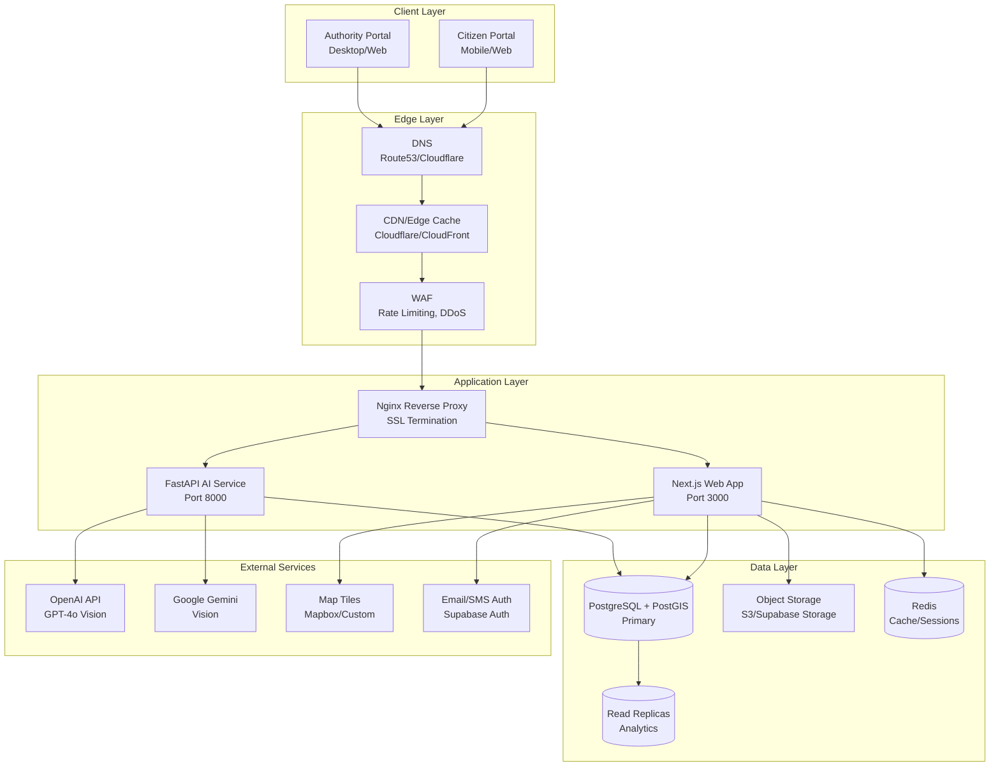
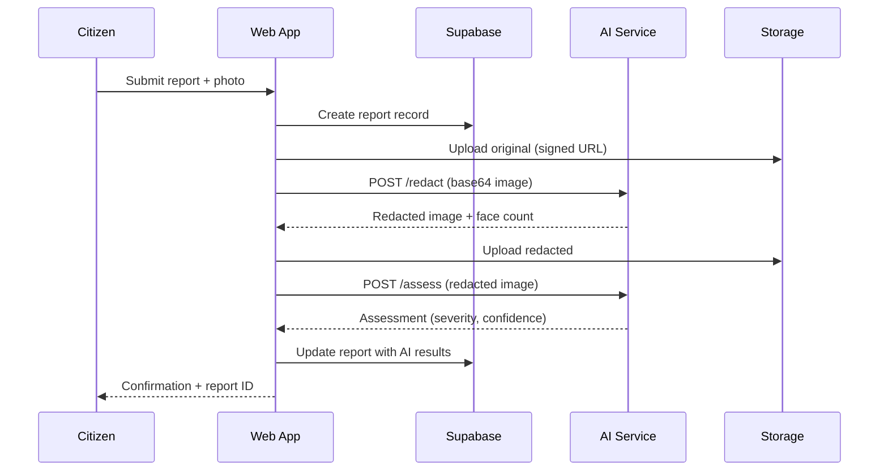
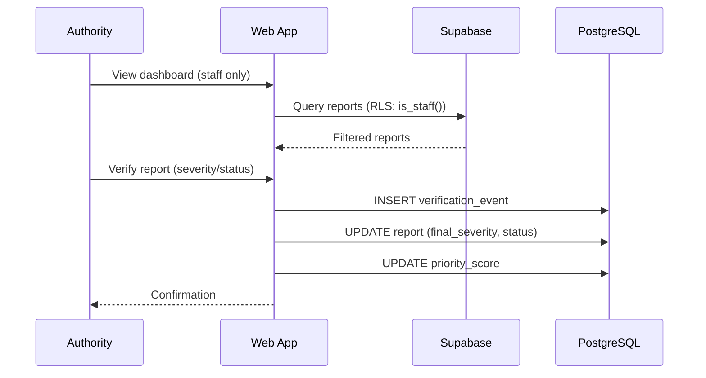
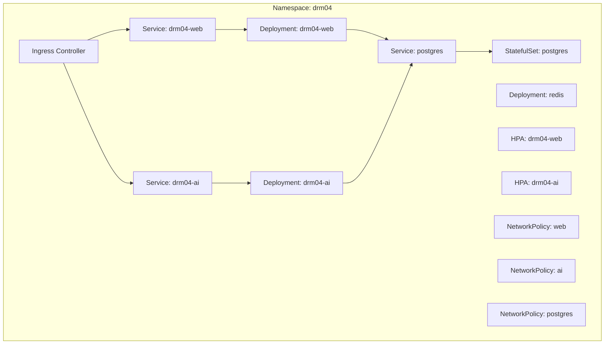

# DRM04 Architecture Documentation

## System Overview

The Crowdsourced Disaster Damage Assessment System (DRM04) is a three-tier architecture designed for rapid disaster response through citizen reporting and AI-assisted triage.

## High-Level Architecture



## Component Details

### 1. Web Application (Next.js 14)

**Technology Stack:**
- Next.js 14 with App Router
- TypeScript (strict mode)
- Tailwind CSS
- Supabase SSR for authentication
- MapLibre GL for mapping

**Key Features:**
- Server Components by default (performance)
- Client Components for interactivity
- Server Actions for mutations
- Middleware for auth/session management
- ISR for static content

**Deployment:**
- Standalone output for Docker
- Multi-stage build (deps → builder → runner)
- Non-root user (UID 1001)
- Health checks: `/api/health/live`, `/api/health/ready`

**Scaling:**
- Horizontal (HPA based on CPU/Memory/Request rate)
- Stateless (session in Redis/cookies)
- CDN for static assets

### 2. AI Service (FastAPI)

**Technology Stack:**
- FastAPI (async Python)
- Uvicorn (ASGI server)
- Pydantic v2 (validation)
- OpenCV (face detection)
- OpenAI/Google GenAI SDKs

**Endpoints:**
- `POST /assess` - Damage assessment from image
- `POST /redact` - Face blurring for privacy
- `GET /health` - Basic health
- `GET /health/ready` - Readiness (model loaded)
- `GET /health/live` - Liveness

**Processing Pipeline:**
```
Image Input → Base64 Decode → Provider Selection
    → Vision Model (GPT-4o/Gemini) → Structured Output
    → Confidence Check → Return Assessment
```

**Fallback Strategy:**
- Demo provider returns deterministic fallback
- Never silently fails - explicit `unclear` status
- Confidence threshold (0.60) triggers human review

**Deployment:**
- Multi-stage Docker build
- 4 Uvicorn workers
- GPU support optional (for local models)
- Health checks with longer startup (model loading)

### 3. Database (PostgreSQL + PostGIS)

**Schema Design:**
- UUID primary keys
- PostGIS for geospatial queries
- Row Level Security (RLS) for multi-tenancy
- JSONB for flexible metadata
- Indexes optimized for query patterns

**Key Tables:**
- `profiles` - User profiles (1:1 with auth.users)
- `jurisdictions` - Geographic boundaries
- `reports` - Citizen disaster reports
- `report_media` - Images (original + redacted)
- `ai_assessments` - AI analysis results
- `verification_events` - Audit trail
- `audit_logs` - System audit log

**RLS Policies:**
- Citizens: own reports only
- Staff (authority/analyst/admin): all reports in jurisdiction
- Admins: full access
- Service role: AI write access

**High Availability:**
- Primary + read replicas
- Automated failover (Patroni/Cloud SQL)
- Point-in-time recovery
- Daily backups + WAL archiving

### 4. Storage (Supabase/S3)

**Buckets:**
- `report-originals` - Private, citizen uploads only
- `report-redacted` - Staff readable, service writable

**Access Control:**
- Signed URLs for upload/download
- RLS on storage.objects
- Admin-only access to originals
- Automatic cleanup policies

### 5. Authentication (Supabase Auth)

**Providers:**
- Email/Password
- Magic Links
- OAuth (Google, GitHub - optional)

**Session Management:**
- JWT in httpOnly cookies
- Server-side validation via Supabase SSR
- Refresh token rotation
- Role claims in JWT

## Data Flow

### Citizen Report Submission



### Authority Verification



## Security Architecture

### Defense in Depth

| Layer | Controls |
|-------|----------|
| **Network** | VPC, Security Groups, Network Policies, WAF |
| **Transport** | TLS 1.2+, mTLS for service-to-service |
| **Application** | CSP, Security Headers, Rate Limiting, Input Validation |
| **Data** | RLS, Encryption at Rest/Transit, Signed URLs |
| **Identity** | MFA, RBAC, Short-lived Tokens, Audit Logging |

### Threat Model

| Threat | Mitigation |
|--------|------------|
| SQL Injection | Parameterized queries, ORM, RLS |
| XSS | CSP, React auto-escaping, HttpOnly cookies |
| CSRF | SameSite cookies, Origin validation |
| Auth Bypass | Server-side session validation, RLS |
| Data Leakage | RLS, Column-level encryption, Signed URLs |
| AI Prompt Injection | Structured output, Input sanitization |
| DoS | Rate limiting, WAF, Auto-scaling |

## Infrastructure

### Kubernetes Resources



### Resource Requirements

| Component | CPU Request | CPU Limit | Memory Request | Memory Limit | Replicas |
|-----------|-------------|-----------|----------------|--------------|----------|
| Web | 500m | 2000m | 512Mi | 2Gi | 3-20 |
| AI | 1000m | 4000m | 2Gi | 8Gi | 2-10 |
| PostgreSQL | 500m | 2000m | 1Gi | 4Gi | 1 (HA: 3) |
| Redis | 250m | 1000m | 256Mi | 1Gi | 1-3 |

## Observability

### Metrics
- **RED Metrics**: Rate, Errors, Duration (per endpoint)
- **USE Metrics**: Utilization, Saturation, Errors (per resource)
- **Business**: Reports submitted, verified, avg response time

### Logging
- Structured JSON logs
- Correlation IDs across services
- Log levels: DEBUG, INFO, WARN, ERROR
- Centralized (Loki/Elasticsearch)

### Tracing
- OpenTelemetry instrumentation
- Distributed traces (Web → AI → DB)
- Sampling: 10% normal, 100% errors

### Alerting
- **Critical**: Service down, DB unavailable, High error rate
- **Warning**: High latency, Queue backlog, Disk space
- **Info**: New deployments, Scaling events

## Disaster Recovery

### RPO/RTO Targets
| Component | RPO | RTO |
|-----------|-----|-----|
| Database | 1 hour | 30 min |
| Application | 0 | 5 min |
| AI Service | 0 | 10 min |
| File Storage | 24 hours | 4 hours |

### Backup Strategy
- **Database**: Continuous WAL + daily pg_dump
- **Storage**: Cross-region replication
- **Config**: GitOps (ArgoCD/Flux)
- **Secrets**: External secrets operator

## Future Considerations

1. **Multi-region**: Active-active for global deployment
2. **Edge Computing**: Cloudflare Workers for offline-first
3. **Custom Models**: Fine-tuned vision models on GPU nodes
4. **Real-time**: WebSockets for live map updates
5. **Analytics**: ClickHouse for analytical queries
6. **Mobile Apps**: React Native / Expo clients